# QQ频道交流

点击链接加入QQ频道【幻兽帕鲁PalWorld】：https://pd.qq.com/s/cfoglmfwc

  

# palworld-go

_✨ 适用于palworld的跨平台服务端面板 ✨_  

_✨ 使用go+quasar实现的palworld webui ✨_  

## 特别鸣谢+推荐

本项目的直接参考（linux版的palworld服务端守护脚本）

https://gist.github.com/Bluefissure/b0fcb05c024ee60cad4e23eb55463062

本项目内置了该项目的编译后网页dist

https://github.com/Bluefissure/pal-conf

特别鸣谢

https://github.com/VeroFess/PalWorld-Server-Unoffical-Api

本项目简化并自动了上方项目的dll注入，为帕鲁服务端命令行引入了增强的rcon api(中文输入)和可操作的命令行控制台。

https://github.com/N00byKing/PalWorld-ServerInjector

本项目简化并自动了上方项目的dll注入，并内置了其注入器的可执行文件。

## 机器人
初步实现了Onebotv11标准的palworld机器人

可配合https://gensokyo.bot 项目在 QQ群 QQ频道 kook频道 Discord群组 部署

支持的机器人特性:面板即机器人 有面板，未搭建机器人的用户，可去中心化的公用已搭建的机器人

目前机器人支持指令:

    	"getbot - 获取机器人信息",

		"player - 获取玩家信息",

		"update player - 更新玩家信息",

		"玩家列表 - 显示玩家列表",

		"刷新玩家列表 - 刷新并显示玩家列表",

		"kick - 踢出玩家",

		"踢人 - 踢出玩家",

		"ban - 封禁玩家",

		"封禁 - 封禁玩家",

		"Broadcast - 发送广播消息",

		"广播 - 发送广播消息",

		"重启服务器 - 重启游戏服务器",

		"restart - 重启游戏服务器",

## 使用方法

The user interface language of this project is in Chinese. 

However, you are free to use the built-in web page translation features of various browsers to translate it into any language of your choice.

Should you encounter any issues, please feel free to submit an issue in any language.

交流群:955320532 587997911

本项目的webui特别对移动端设备进行优化，手机使用更轻松
（老版本iossafari 如果遇到按钮点不动刷新页面再点即可）

webui可友善的可视化的修改帕鲁服务器，守护配置，内存配置，目前webui端口固定8000

将可执行文件放置在

\steamcmd\steamapps\common\PalServer\PalServer.exe

同级目录

运行palworld-go.exe 会自动进入webui

webui默认地址:http://127.0.0.1:8000

端口可在config.json修改，放通至公网可在公网访问

控制台默认用户名 palgo 默认密码 useradmin

用户名即帕鲁服务器名（serverName），可中文 密码即rcon密码（adminPassword） 纯英文

图片介绍

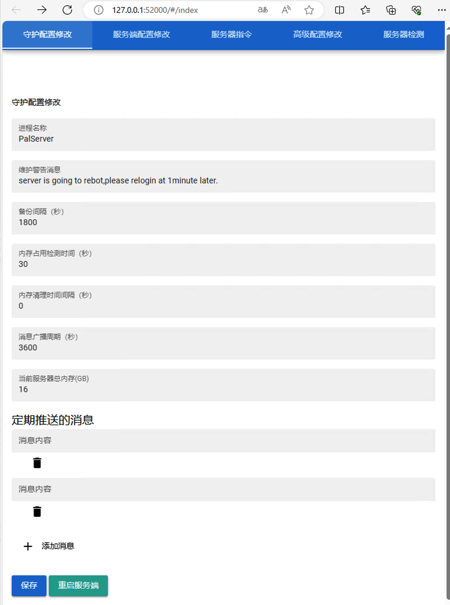

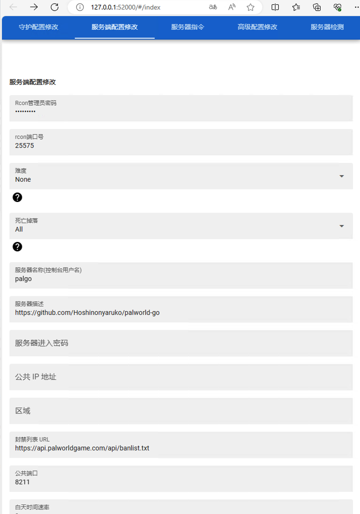

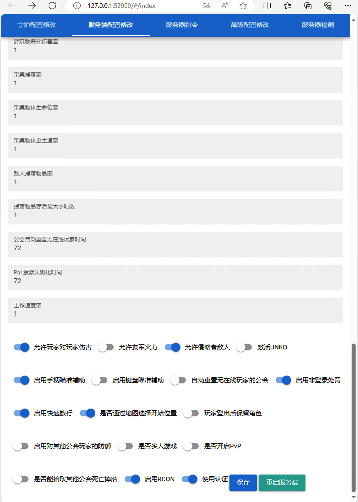

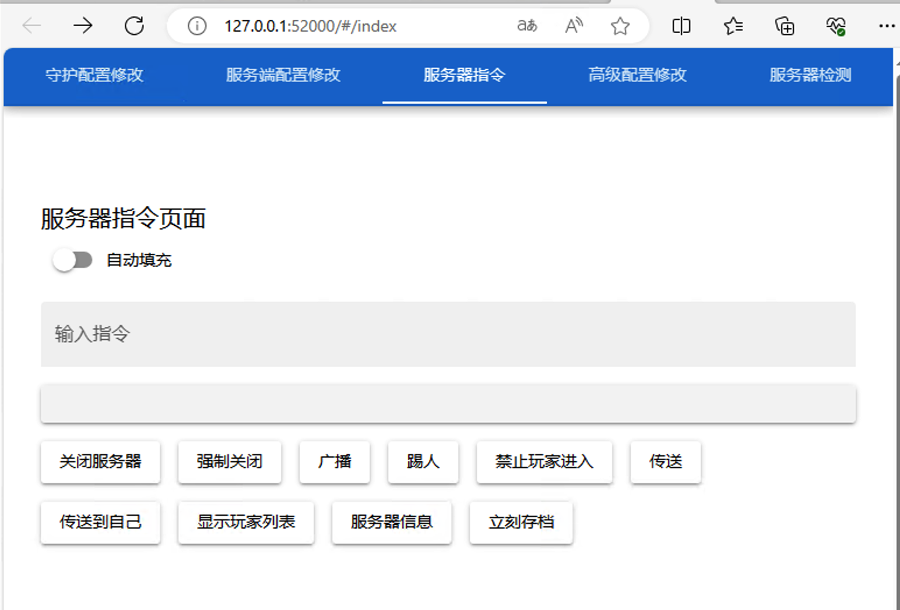

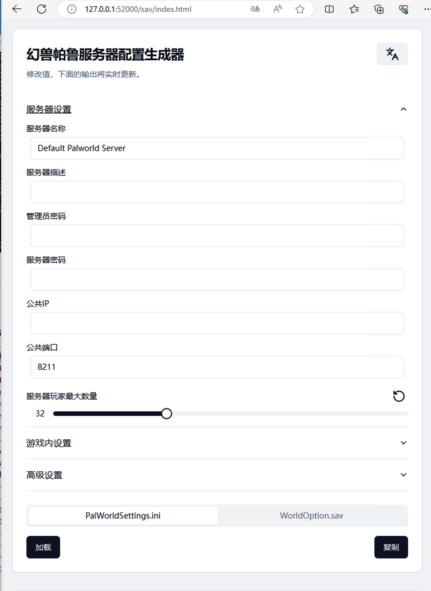

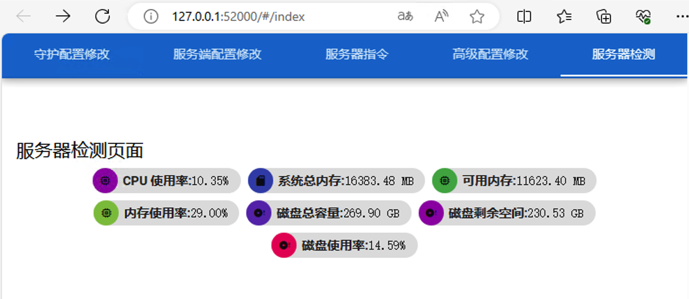

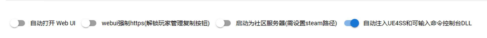

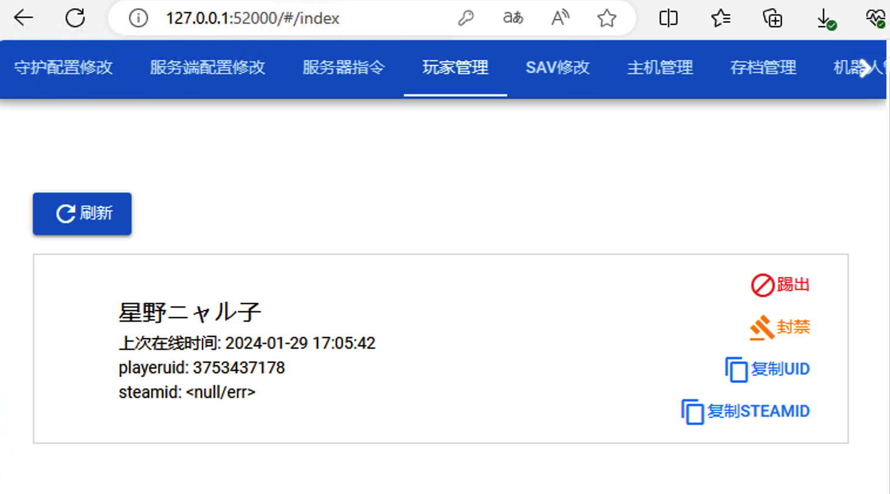

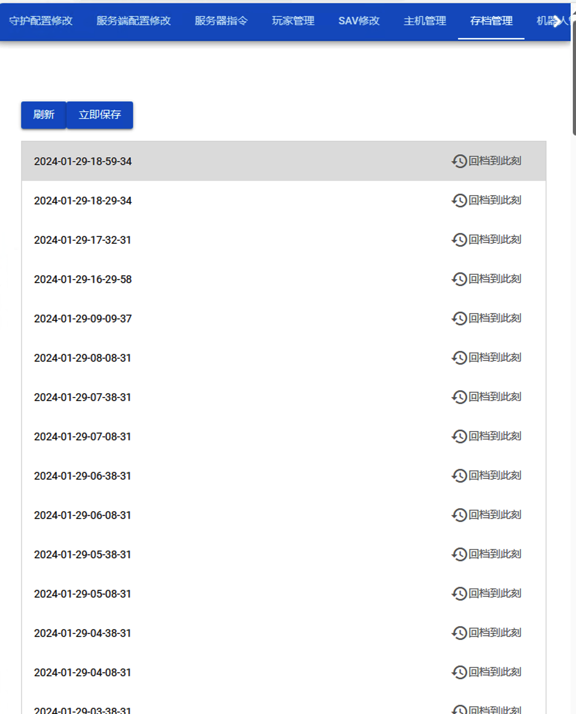

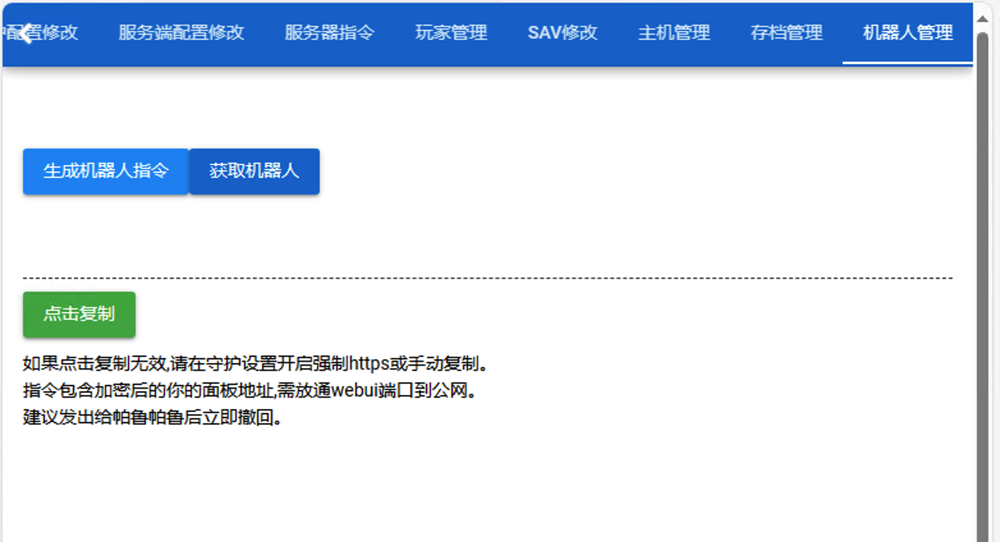

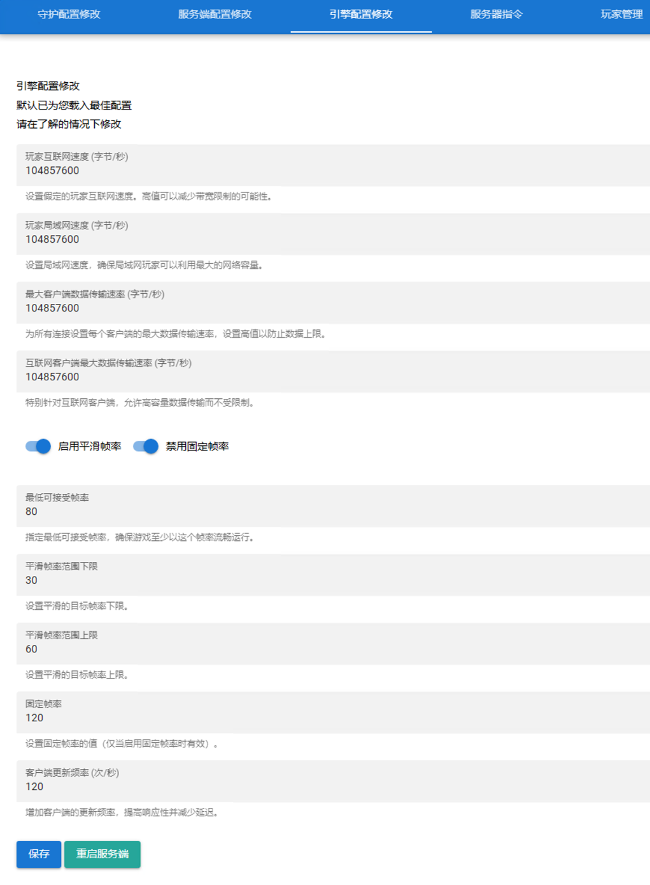

## 兼容性
windows通过了测试，linux有待测试

## RCON发送中文

内置了

https://github.com/VeroFess/PalWorld-Server-Unoffical-Api/releases/tag/previev-0.0.2

开启-守护配置修改-自动注入DLL 可在palworld命令行使用 Broadcast 中文

完全是得益于VeroFess的开发，palgo面板只是自动做了载入。

## 场景支持

在手机上痛快的操作和管理服务器，当管理不再手忙脚乱。

内存不足的时候，通过rcon通知服务器成员，然后重启服务器

通过调用微软的rammap释放无用内存，并将有用内存转移至虚拟内存，实现一次释放50%+内存

## 贴心提示

如果启动自动注入UE4SS和可输入命令控制台DLL后游戏服务端无法启动

请定位到"\PalServer\Pal\Binaries\Win64\UE4SS-settings.ini"

打开，定位到GraphicsAPI，修改为dx11
; The API that will be used to render the GUI debug window.

; Valid values (case-insensitive): dx11, d3d11, opengl

; Default: opengl

GraphicsAPI = dx11

或设置Debug 配置项 3个值 全部为0